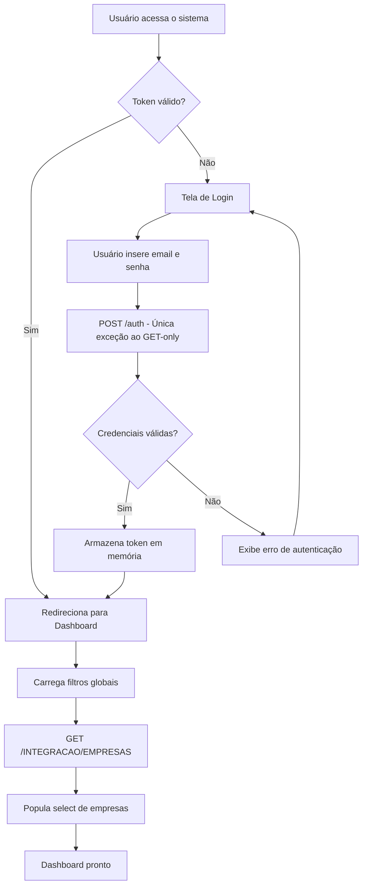
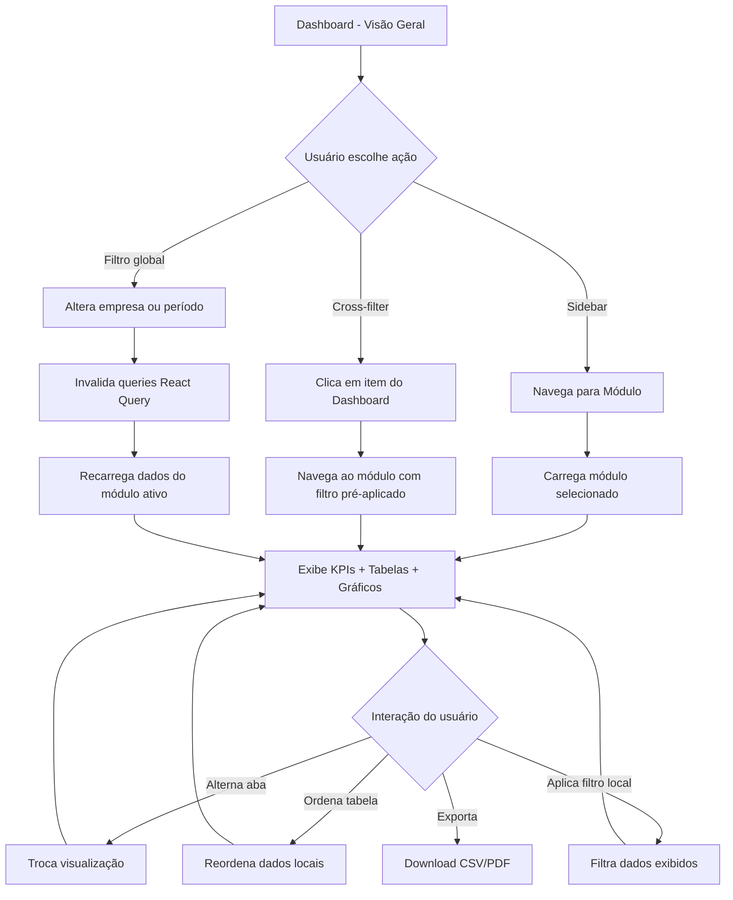
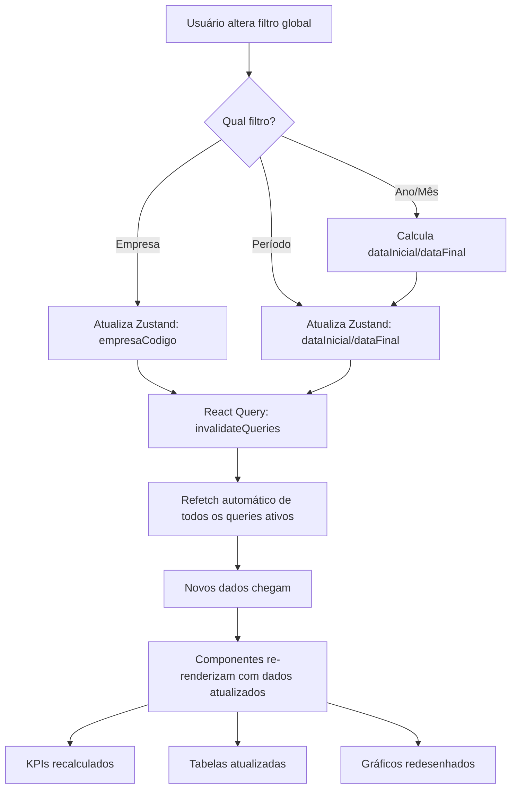
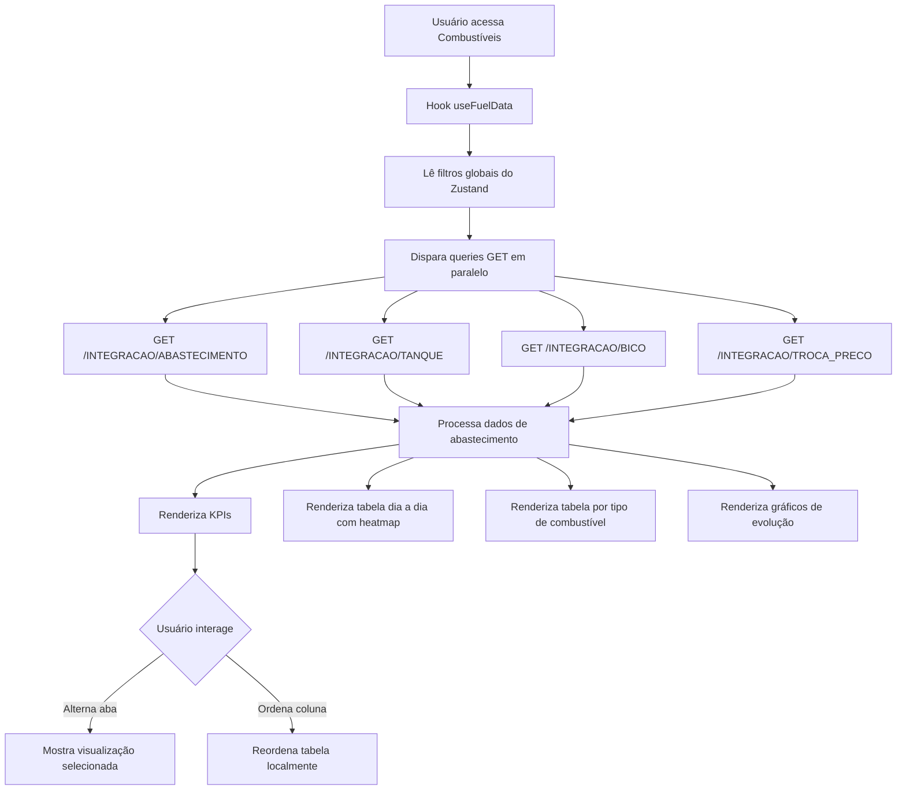
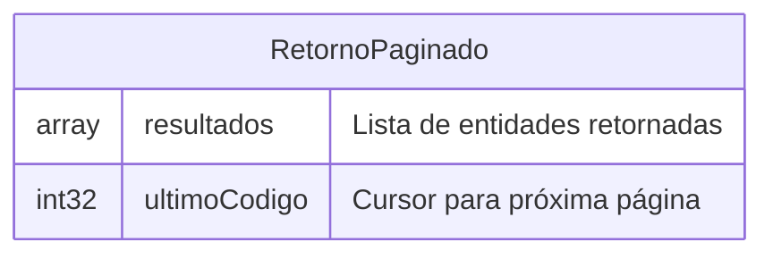
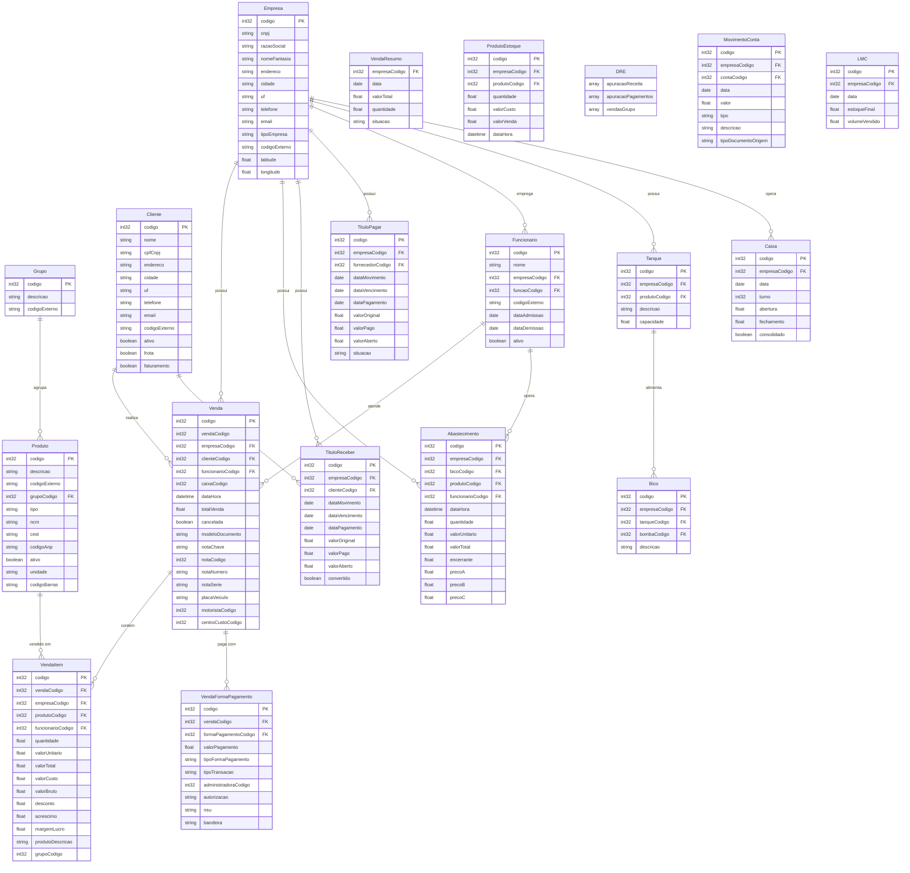
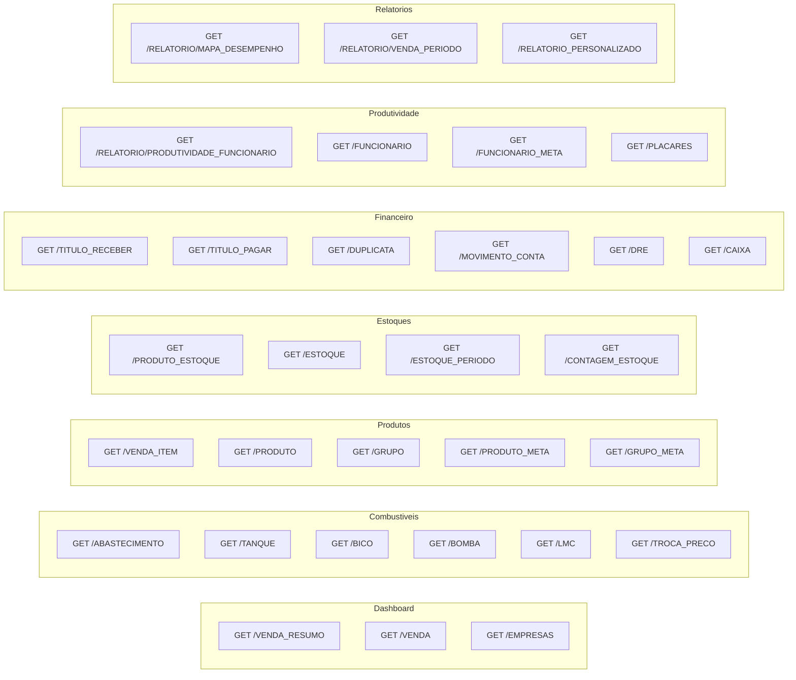

# PRD — CCISGA (CCI Sistema de Gestão Analítica)

**Versão:** 1.0
**Data:** 27/02/2026
**Autor:** CCI Consultoria
**Status:** Rascunho

---

> **⚠️ REGRA DE OURO — SISTEMA SOMENTE LEITURA (READ-ONLY)**
>
> Este sistema é **exclusivamente de análise e visualização de dados**. De todos os ~97 endpoints GET disponíveis na API Quality Automação, o CCISGA utilizará **SOMENTE requisições HTTP GET**. Em **nenhuma hipótese** o sistema deve realizar chamadas POST, PUT, DELETE, PATCH ou qualquer outro método que envie, altere, crie ou exclua dados. A **única exceção** é o endpoint de autenticação (login), que requer POST para envio de credenciais. Após autenticado, **100% das chamadas à API devem ser GET**.

---

## Sumário

1. [Visão Geral](#1-visão-geral)
2. [Sobre o Produto](#2-sobre-o-produto)
3. [Propósito](#3-propósito)
4. [Público-Alvo](#4-público-alvo)
5. [Objetivos](#5-objetivos)
6. [Requisitos Funcionais](#6-requisitos-funcionais)
7. [Fluxos de UX (Flowcharts)](#7-fluxos-de-ux-flowcharts)
8. [Requisitos Não-Funcionais](#8-requisitos-não-funcionais)
9. [Arquitetura Técnica](#9-arquitetura-técnica)
10. [Stack](#10-stack)
11. [Estrutura de Dados (Schemas)](#11-estrutura-de-dados-schemas)
12. [Design System](#12-design-system)
13. [User Stories](#13-user-stories)
14. [Épicos](#14-épicos)
15. [Critérios de Aceite](#15-critérios-de-aceite)
16. [Métricas de Sucesso](#16-métricas-de-sucesso)
17. [Riscos e Mitigações](#17-riscos-e-mitigações)
18. [Lista de Tarefas (Sprints)](#18-lista-de-tarefas-sprints)

---

## 1. Visão Geral

O **CCISGA** é um dashboard analítico web para redes de postos de combustível que consome dados em tempo real da API REST da Quality Automação. O sistema consolida informações de vendas, combustíveis, produtos, estoques, financeiro, produtividade de funcionários e conveniências em visualizações interativas com KPIs, gráficos, tabelas com heatmap e filtros inteligentes vinculados.

O sistema é **puramente de leitura** — não possui funcionalidades de criação, edição ou exclusão de registros. Toda interação do usuário se limita a: navegar entre módulos, aplicar filtros de consulta, alternar abas de visualização, ordenar tabelas e exportar dados.

---

## 2. Sobre o Produto

| Atributo | Valor |
|---|---|
| **Nome** | CCISGA — CCI Sistema de Gestão Analítica |
| **Tipo** | SPA (Single Page Application) — Dashboard Analítico |
| **Plataforma** | Web (Desktop-first, responsivo) |
| **API Externa** | Quality Automação (`https://web.qualityautomacao.com.br/INTEGRACAO/`) |
| **Endpoints utilizados** | ~97 endpoints GET (de ~140 totais na API) |
| **Métodos HTTP** | GET exclusivamente (exceção: POST para login) |
| **Idioma da interface** | Português Brasileiro (pt-BR) |
| **Idioma do código** | Inglês |
| **Autenticação** | Bearer Token / JWT via API-Key |
| **Backend próprio** | Não — frontend-only consumindo API externa |

---

## 3. Propósito

Prover uma ferramenta de **análise e tomada de decisão** para gestores de redes de postos de combustível, consolidando dados operacionais, financeiros e de produtividade em uma interface moderna, intuitiva e visualmente rica. O sistema substitui dashboards legados com uma experiência de usuário superior, mantendo a mesma fonte de dados (API Quality Automação) e adicionando capacidades de:

- Visualização consolidada multi-empresa
- Filtros inteligentes vinculados entre módulos
- KPIs com indicadores de variação e projeções
- Tabelas com heatmap de performance
- Rankings e análises comparativas (Pareto, Curva ABC)
- Navegação cross-filter entre módulos

---

## 4. Público-Alvo

| Persona | Perfil | Uso Principal |
|---|---|---|
| **Gestor da Rede** | Proprietário ou diretor da rede de postos | Dashboard consolidado, KPIs de alto nível, projeções financeiras |
| **Gerente de Posto** | Responsável operacional de uma unidade | Vendas diárias, produtividade da equipe, controle de combustíveis |
| **Analista Financeiro** | Profissional de finanças/contabilidade | Títulos a pagar/receber, fluxo de caixa, DRE |
| **Coordenador de Estoque** | Responsável por abastecimento e inventário | Níveis de estoque, movimentações, contagens |
| **Consultor CCI** | Consultor da CCI Consultoria | Todos os módulos — análise consultiva para clientes |

Todos os usuários são **pré-cadastrados** (não há auto-registro). O acesso é controlado via credenciais fornecidas pela administração.

---

## 5. Objetivos

### 5.1 Objetivos de Negócio

- Centralizar a análise de dados operacionais de postos de combustível em uma única interface
- Reduzir o tempo de tomada de decisão de gestores com dados consolidados e visuais
- Substituir dashboards legados por uma interface moderna e responsiva
- Permitir análise comparativa entre empresas/unidades da rede

### 5.2 Objetivos de Produto

- Entregar uma SPA performática com carregamento de dados < 3s
- Implementar filtros inteligentes que sincronizem automaticamente entre módulos
- Prover visualizações de dados com heatmap, rankings e indicadores de variação
- Garantir 100% de compliance com a regra de somente leitura (zero chamadas de escrita)

---

## 6. Requisitos Funcionais

### RF-01: Autenticação

| ID | Requisito |
|---|---|
| RF-01.1 | Tela de login com campos email e senha |
| RF-01.2 | Autenticação via POST para endpoint de login da API (única exceção à regra GET-only) |
| RF-01.3 | Armazenamento seguro do token (memória/httpOnly cookie, nunca localStorage) |
| RF-01.4 | Proteção de rotas — redirecionar para login quando não autenticado |
| RF-01.5 | Logout com limpeza completa de estado e cache |
| RF-01.6 | Interceptor no header `API-Key` para todas as requisições autenticadas |

### RF-02: Filtros Globais (Smart Linked Filters)

| ID | Requisito |
|---|---|
| RF-02.1 | Barra de filtros persistente no header: Empresa, Ano, Mês, Intervalo de datas |
| RF-02.2 | Filtros persistem entre navegações de módulos via Zustand |
| RF-02.3 | Alteração de empresa invalida queries dependentes via React Query |
| RF-02.4 | Alteração de período recarrega automaticamente todos os dados do módulo ativo |
| RF-02.5 | Select de empresa populado via `GET /INTEGRACAO/EMPRESAS` |
| RF-02.6 | Cross-filter: clicar em item do Dashboard navega ao módulo detalhado com filtros pré-aplicados |

### RF-03: Dashboard (Visão Geral)

| ID | Requisito |
|---|---|
| RF-03.1 | KPIs consolidados: faturamento total, volume de combustíveis, ticket médio, margem |
| RF-03.2 | Cards de setor: Combustível, Automotivos, Conveniência — cada um com faturamento, variação e projeção |
| RF-03.3 | Tabela de projeção mensal com realizado vs. projetado |
| RF-03.4 | Tabela detalhada por empresa com heatmap de variação |
| RF-03.5 | Dados consumidos de `GET /INTEGRACAO/VENDA_RESUMO`, `GET /INTEGRACAO/VENDA`, `GET /INTEGRACAO/EMPRESAS` |

### RF-04: Módulo Combustíveis

| ID | Requisito |
|---|---|
| RF-04.1 | KPIs: litros vendidos, faturamento, margem, preço médio (venda e custo) |
| RF-04.2 | Tabela dia a dia com heatmap de margem |
| RF-04.3 | Tabela por tipo de combustível (gasolina, etanol, diesel, GNV) |
| RF-04.4 | Gráfico mensal de evolução (área/linha) |
| RF-04.5 | Análise semanal com agrupamento por dia da semana |
| RF-04.6 | Abas: Dia a Dia, Por Combustível, Evolução, Análise Semanal |
| RF-04.7 | Dados de `GET /INTEGRACAO/ABASTECIMENTO`, `GET /INTEGRACAO/BICO`, `GET /INTEGRACAO/BOMBA`, `GET /INTEGRACAO/TANQUE`, `GET /INTEGRACAO/LMC`, `GET /INTEGRACAO/TROCA_PRECO` |

### RF-05: Módulo Produtos (Automotivos)

| ID | Requisito |
|---|---|
| RF-05.1 | KPIs: faturamento, quantidade vendida, margem total, ticket médio |
| RF-05.2 | Tabela por grupo de produto com heatmap de margem |
| RF-05.3 | Gráfico de Pareto (80/20) por grupo |
| RF-05.4 | Análise Curva ABC |
| RF-05.5 | Abas: Por Grupo, Pareto, Curva ABC |
| RF-05.6 | Dados de `GET /INTEGRACAO/VENDA_ITEM`, `GET /INTEGRACAO/PRODUTO`, `GET /INTEGRACAO/GRUPO`, `GET /INTEGRACAO/PRODUTO_META` |

### RF-06: Módulo Conveniências

| ID | Requisito |
|---|---|
| RF-06.1 | KPIs: faturamento, margem, quantidade de itens, ticket médio |
| RF-06.2 | Tabela dia a dia com heatmap |
| RF-06.3 | Tabela por grupo de produto de conveniência |
| RF-06.4 | Gráfico de faturamento (barras/área) |
| RF-06.5 | Abas: Dia a Dia, Por Grupo, Evolução |
| RF-06.6 | Dados de `GET /INTEGRACAO/VENDA_ITEM`, `GET /INTEGRACAO/PRODUTO`, `GET /INTEGRACAO/GRUPO` (filtrado por grupos de conveniência) |

### RF-07: Módulo Estoques

| ID | Requisito |
|---|---|
| RF-07.1 | KPIs: valor total em estoque, itens abaixo do mínimo, giro médio |
| RF-07.2 | Tabela de posição de estoque atual por produto |
| RF-07.3 | Gráfico de movimentação de estoque (entradas vs. saídas) |
| RF-07.4 | Dados de `GET /INTEGRACAO/PRODUTO_ESTOQUE`, `GET /INTEGRACAO/ESTOQUE`, `GET /INTEGRACAO/ESTOQUE_PERIODO`, `GET /INTEGRACAO/CONTAGEM_ESTOQUE` |

### RF-08: Módulo Produtividade

| ID | Requisito |
|---|---|
| RF-08.1 | Card do campeão de vendas (funcionário com maior faturamento) |
| RF-08.2 | Ranking de vendas por funcionário (barras horizontais) |
| RF-08.3 | Ranking de conversão (ticket médio por funcionário) |
| RF-08.4 | Ranking de ticket médio |
| RF-08.5 | Abas: Ranking Geral, Conversão, Ticket Médio |
| RF-08.6 | Dados de `GET /INTEGRACAO/RELATORIO/PRODUTIVIDADE_FUNCIONARIO`, `GET /INTEGRACAO/FUNCIONARIO`, `GET /INTEGRACAO/FUNCIONARIO_META`, `GET /INTEGRACAO/PLACARES` |

### RF-09: Módulo Financeiro

| ID | Requisito |
|---|---|
| RF-09.1 | KPIs: total a receber, total a pagar, saldo líquido, inadimplência |
| RF-09.2 | Tabela de títulos a receber com filtros de situação |
| RF-09.3 | Tabela de títulos a pagar com filtros de situação |
| RF-09.4 | Gráfico de fluxo de caixa (entradas vs. saídas por período) |
| RF-09.5 | DRE (Demonstrativo de Resultado) |
| RF-09.6 | Abas: Receber, Pagar, Fluxo de Caixa, DRE |
| RF-09.7 | Dados de `GET /INTEGRACAO/TITULO_RECEBER`, `GET /INTEGRACAO/TITULO_PAGAR`, `GET /INTEGRACAO/DUPLICATA`, `GET /INTEGRACAO/MOVIMENTO_CONTA`, `GET /INTEGRACAO/DRE`, `GET /INTEGRACAO/CAIXA` |

### RF-10: Módulo Relatórios

| ID | Requisito |
|---|---|
| RF-10.1 | Seletor de relatório disponível via `GET /INTEGRACAO/RELATORIO_PERSONALIZADO` |
| RF-10.2 | Visualizador de relatórios pré-configurados (mapa de desempenho, vendas por período, produtividade) |
| RF-10.3 | Dados de `GET /INTEGRACAO/RELATORIO/MAPA_DESEMPENHO`, `GET /INTEGRACAO/RELATORIO/VENDA_PERIODO`, `GET /INTEGRACAO/RELATORIO/PRODUTIVIDADE_FUNCIONARIO`, `GET /INTEGRACAO/RELATORIO/RELATORIO_PERSONALIZADO/{codigo}` |

---

## 7. Fluxos de UX (Flowcharts)

### 7.1 Fluxo de Autenticação



### 7.2 Fluxo Principal de Navegação



### 7.3 Fluxo de Filtros Inteligentes



### 7.4 Fluxo de Módulo (Exemplo: Combustíveis)



---

## 8. Requisitos Não-Funcionais

### RNF-01: Performance

| ID | Requisito |
|---|---|
| RNF-01.1 | First Contentful Paint (FCP) < 1.5s |
| RNF-01.2 | Time to Interactive (TTI) < 3s |
| RNF-01.3 | Carregamento de dados de qualquer módulo < 3s |
| RNF-01.4 | Cache de dados via React Query com staleTime configurável por tipo de dado |
| RNF-01.5 | Paginação de endpoints que suportam `ultimoCodigo` e `limite` |

### RNF-02: Segurança

| ID | Requisito |
|---|---|
| RNF-02.1 | Token armazenado em memória ou httpOnly cookie (nunca localStorage) |
| RNF-02.2 | Interceptor HTTP que **bloqueia** qualquer requisição não-GET (exceto POST /auth) |
| RNF-02.3 | Rotas protegidas com redirecionamento para login |
| RNF-02.4 | Limpeza de estado e cache no logout |
| RNF-02.5 | Headers de segurança no client HTTP (API-Key, Bearer Token) |

### RNF-03: Usabilidade

| ID | Requisito |
|---|---|
| RNF-03.1 | Interface responsiva: desktop (1280px+), tablet (768px), mobile (320px) |
| RNF-03.2 | Sidebar colapsável para maximizar área de conteúdo |
| RNF-03.3 | Feedback visual em carregamento (skeletons/spinners) |
| RNF-03.4 | Mensagens de erro amigáveis em português |
| RNF-03.5 | Interface inteiramente em português brasileiro |

### RNF-04: Manutenibilidade

| ID | Requisito |
|---|---|
| RNF-04.1 | TypeScript strict mode em todo o projeto |
| RNF-04.2 | Estrutura feature-based (um módulo por pasta) |
| RNF-04.3 | Componentes funcionais com hooks |
| RNF-04.4 | Path aliases (@/) para imports |
| RNF-04.5 | Código limpo sem abstrações prematuras |

### RNF-05: Confiabilidade READ-ONLY

| ID | Requisito |
|---|---|
| RNF-05.1 | Client HTTP configurado para rejeitar automaticamente métodos não-GET |
| RNF-05.2 | Zero tipos TypeScript para request bodies de escrita |
| RNF-05.3 | Zero uso de `useMutation` do TanStack Query |
| RNF-05.4 | Zero formulários de envio de dados na interface |
| RNF-05.5 | Zero botões de criação, edição ou exclusão na UI |

---

## 9. Arquitetura Técnica

### 9.1 Visão Geral da Arquitetura

```
┌─────────────────────────────────────────────────┐
│                   CCISGA (SPA)                   │
│                                                   │
│  ┌─────────┐  ┌──────────┐  ┌────────────────┐  │
│  │ Zustand  │  │  React   │  │  TanStack      │  │
│  │ (filtros)│◄►│  Router  │  │  Query (cache) │  │
│  └─────────┘  └──────────┘  └───────┬────────┘  │
│                                       │           │
│  ┌────────────────────────────────────┴────────┐ │
│  │      HTTP Client (Axios/Fetch)              │ │
│  │  ┌──────────────────────────────────────┐   │ │
│  │  │ INTERCEPTOR: BLOQUEIA não-GET        │   │ │
│  │  │ (exceção: POST /auth)                │   │ │
│  │  └──────────────────────────────────────┘   │ │
│  └─────────────────────┬──────────────────────┘ │
└────────────────────────┼────────────────────────┘
                         │ HTTPS (somente GET*)
                         ▼
         ┌───────────────────────────────┐
         │  API Quality Automação         │
         │  ~97 endpoints GET utilizados  │
         │  Base: /INTEGRACAO/            │
         └───────────────────────────────┘

         * Única exceção: POST para login
```

### 9.2 Estrutura de Diretórios

```
ccisga/
├── index.html
├── package.json
├── tsconfig.json
├── tsconfig.app.json
├── tsconfig.node.json
├── vite.config.ts
├── tailwind.config.ts
├── postcss.config.js
├── components.json              # shadcn/ui config
├── .env                         # VITE_API_BASE_URL
├── .env.example
├── .gitignore
├── public/
│   └── favicon.ico
└── src/
    ├── main.tsx                 # Entry point
    ├── App.tsx                  # Providers + Router
    ├── index.css                # Tailwind directives + globals
    ├── vite-env.d.ts
    ├── api/
    │   ├── client.ts            # HTTP client com interceptor GET-only
    │   ├── endpoints/           # SOMENTE funções GET (exceto auth.ts)
    │   │   ├── auth.ts
    │   │   ├── vendas.ts
    │   │   ├── produtos.ts
    │   │   ├── combustiveis.ts
    │   │   ├── estoques.ts
    │   │   ├── funcionarios.ts
    │   │   ├── financeiro.ts
    │   │   ├── clientes.ts
    │   │   ├── empresas.ts
    │   │   └── relatorios.ts
    │   └── types/               # Apenas tipos de resposta GET
    │       ├── auth.ts
    │       ├── venda.ts
    │       ├── produto.ts
    │       ├── cliente.ts
    │       ├── funcionario.ts
    │       ├── empresa.ts
    │       ├── financeiro.ts
    │       ├── estoque.ts
    │       └── common.ts
    ├── components/
    │   ├── ui/                  # shadcn/ui components
    │   ├── charts/
    │   │   ├── AreaChart.tsx
    │   │   ├── BarChart.tsx
    │   │   ├── HorizontalBarChart.tsx
    │   │   └── PieChart.tsx
    │   ├── filters/
    │   │   ├── GlobalFilterBar.tsx
    │   │   ├── CompanySelect.tsx
    │   │   ├── PeriodSelect.tsx
    │   │   └── DateRangePicker.tsx
    │   ├── tables/
    │   │   ├── DataTable.tsx
    │   │   └── HeatmapCell.tsx
    │   ├── kpi/
    │   │   ├── KpiCard.tsx
    │   │   └── KpiGrid.tsx
    │   └── layout/
    │       ├── AppLayout.tsx
    │       ├── Sidebar.tsx
    │       ├── Header.tsx
    │       └── ProtectedRoute.tsx
    ├── pages/
    │   ├── Login/
    │   │   └── index.tsx
    │   ├── Dashboard/
    │   │   ├── index.tsx
    │   │   ├── components/
    │   │   └── hooks/
    │   ├── Combustiveis/
    │   │   ├── index.tsx
    │   │   ├── components/
    │   │   └── hooks/
    │   ├── Produtos/
    │   │   ├── index.tsx
    │   │   ├── components/
    │   │   └── hooks/
    │   ├── Conveniencias/
    │   │   ├── index.tsx
    │   │   ├── components/
    │   │   └── hooks/
    │   ├── Estoques/
    │   │   ├── index.tsx
    │   │   ├── components/
    │   │   └── hooks/
    │   ├── Produtividade/
    │   │   ├── index.tsx
    │   │   ├── components/
    │   │   └── hooks/
    │   ├── Financeiro/
    │   │   ├── index.tsx
    │   │   ├── components/
    │   │   └── hooks/
    │   └── Relatorios/
    │       ├── index.tsx
    │       └── components/
    ├── store/
    │   └── filters.ts           # Zustand — filtros globais
    ├── hooks/
    │   ├── useAuth.ts
    │   └── useFilters.ts
    ├── lib/
    │   ├── formatters.ts
    │   ├── constants.ts
    │   └── utils.ts
    └── routes/
        └── index.tsx
```

### 9.3 Padrão de Comunicação com API

```
Componente → Hook customizado → useQuery (TanStack Query) → endpoint function → HTTP Client (GET only) → API
```

**Regras:**
- Todo acesso a dados passa por `useQuery` (nunca `useMutation`)
- Todo endpoint function usa apenas `client.get()`
- O HTTP client possui interceptor que rejeita métodos não-GET (exceto POST /auth)
- Query keys incluem filtros globais para invalidação automática

---

## 10. Stack

| Camada | Tecnologia | Justificativa |
|---|---|---|
| **Framework** | React 18+ | Ecossistema maduro, componentização |
| **Linguagem** | TypeScript (strict) | Segurança de tipos, melhor DX |
| **Bundler** | Vite | Build rápido, HMR instantâneo |
| **Estilização** | TailwindCSS | Utility-first, consistência, produtividade |
| **Componentes UI** | shadcn/ui | Componentes acessíveis, customizáveis, sem lock-in |
| **Gráficos** | Recharts | Composição declarativa com React |
| **Data Fetching** | TanStack Query (React Query) | Cache, invalidação, loading/error states — **somente `useQuery`** |
| **Roteamento** | React Router v6 | Rotas declarativas, nested routes, protected routes |
| **Estado Global** | Zustand | Leve, simples, sem boilerplate — apenas filtros globais |
| **HTTP Client** | Axios ou Fetch | Com interceptor que **bloqueia métodos não-GET** |

> **Nota READ-ONLY:** O TanStack Query será usado exclusivamente com `useQuery` para leitura de dados. O hook `useMutation` **não deve ser utilizado** em nenhuma parte do código, pois o sistema não realiza operações de escrita.

---

## 11. Estrutura de Dados (Schemas)

### 11.1 Padrão de Paginação da API



Todos os endpoints paginados seguem este padrão: `RetornoPaginado{Entity}` contém `resultados[]` e `ultimoCodigo`.

### 11.2 Entidades Principais



### 11.3 Mapeamento de Endpoints por Módulo



---

## 12. Design System

### 12.1 Paleta de Cores

| Token | Hex | Uso |
|---|---|---|
| `--color-primary` | `#1e3a5f` | Cor principal (navy). Sidebar, headers, botões primários |
| `--color-accent` | `#2563eb` | Acento. Links, item ativo do sidebar, focus rings |
| `--color-bg` | `#ffffff` | Fundo principal |
| `--color-bg-secondary` | `#f9fafb` (gray-50) | Fundo de cards e áreas secundárias |
| `--color-border` | `#e5e7eb` (gray-200) | Bordas de cards, tabelas, inputs |
| `--color-positive` | `#22c55e` (green-500) | Variações positivas, métricas boas |
| `--color-negative` | `#ef4444` (red-500) | Variações negativas, métricas ruins |
| `--color-warning` | `#f59e0b` (amber-500) | Alertas, atenção |
| `--color-text` | `#111827` (gray-900) | Texto principal |
| `--color-text-secondary` | `#6b7280` (gray-500) | Texto secundário, labels |
| `--color-table-header` | `#f3f4f6` (gray-100) | Cabeçalho de tabelas |

### 12.2 Tipografia

| Elemento | Fonte | Peso | Tamanho |
|---|---|---|---|
| **Fonte principal** | Inter | — | — |
| KPI valor principal | Inter | 700 (bold) | text-3xl (30px) |
| KPI valor secundário | Inter | 600 (semibold) | text-2xl (24px) |
| Título de seção | Inter | 600 | text-lg (18px) |
| Texto de tabela | Inter | 400 (regular) | text-sm (14px) |
| Labels e captions | Inter | 500 (medium) | text-xs (12px) |
| Botão primário | Inter | 500 | text-sm (14px) |

### 12.3 Componentes

#### Botões (somente filtros e navegação — sem ações de escrita)

| Variante | Estilo |
|---|---|
| **Primário** | `bg-[#1e3a5f] text-white hover:bg-[#2a4a73] rounded-lg` |
| **Secundário** | `border border-gray-200 bg-transparent hover:bg-gray-50 rounded-lg` |
| **Ghost** | `bg-transparent hover:bg-gray-100 rounded-lg` |
| **Tamanhos** | `sm` (h-8 px-3), `md` (h-10 px-4), `lg` (h-12 px-6) |

> **Nota:** Não existem botões de "Criar", "Salvar", "Editar" ou "Excluir" no sistema. Botões são usados apenas para: filtrar, navegar, alternar abas, exportar.

#### Inputs (somente filtros de consulta)

| Propriedade | Valor |
|---|---|
| Border radius | `rounded-lg` |
| Border | `border-gray-200` |
| Focus | `ring-2 ring-[#2563eb] ring-offset-1` |
| Label | Acima do campo, `text-sm font-medium text-gray-700` |

> **Nota:** Inputs são usados exclusivamente em filtros de consulta (selects de empresa, date pickers, etc.). Não há formulários de envio de dados.

#### Cards de KPI

```
┌─────────────────────────────┐
│ 📊 Label do KPI    ▲ +12%  │  <- text-sm, variação em green/red
│                              │
│ R$ 1.234.567               │  <- text-3xl font-bold
│                              │
│ vs. mês anterior: R$ 1.1M  │  <- text-xs text-gray-500
└─────────────────────────────┘

Estilo: bg-white rounded-xl border border-gray-200 shadow-sm p-6
Grid: 4-5 colunas desktop, 2 tablet, 1 mobile
```

#### Tabelas com Heatmap

| Propriedade | Valor |
|---|---|
| Header | `bg-gray-100 text-gray-600 text-xs font-medium uppercase` |
| Linhas | Alternadas `even:bg-gray-50` |
| Hover | `hover:bg-blue-50` |
| Heatmap positivo | Gradiente `bg-green-50` a `bg-green-200` proporcional ao valor |
| Heatmap negativo | Gradiente `bg-red-50` a `bg-red-200` proporcional ao valor |
| Border | `divide-y divide-gray-200` |

#### Sidebar

| Propriedade | Valor |
|---|---|
| Largura expandida | `w-64` |
| Largura colapsada | `w-16` (apenas ícones) |
| Background | `bg-[#1e3a5f]` |
| Texto | `text-white/70 hover:text-white` |
| Item ativo | `bg-white/10 border-l-4 border-[#2563eb] text-white` |
| Ícones | Lucide React |

#### Grid Responsivo

| Breakpoint | Colunas KPI | Layout |
|---|---|---|
| Desktop (1280px+) | 4-5 colunas | Sidebar + conteúdo |
| Tablet (768px) | 2 colunas | Sidebar colapsada + conteúdo |
| Mobile (320px) | 1 coluna | Sidebar oculta + menu hambúrguer |

### 12.4 Gráficos (Recharts)

| Tipo | Uso |
|---|---|
| **Área/Linha** | Séries temporais (evolução mensal, fluxo de caixa) |
| **Barras verticais** | Comparativos por período (dia a dia, mês a mês) |
| **Barras horizontais** | Rankings (funcionários, produtos, grupos) |
| **Pizza/Donut** | Distribuição (formas de pagamento, participação por grupo) |

Cores dos gráficos: derivadas da paleta principal (`#1e3a5f`, `#2563eb`, `#3b82f6`, `#60a5fa`, `#93c5fd`).

---

## 13. User Stories

### US-01: Autenticação

| ID | Como... | Quero... | Para que... |
|---|---|---|---|
| US-01.1 | Usuário | Fazer login com email e senha | Acessar o sistema de forma segura |
| US-01.2 | Usuário | Ser redirecionado ao login quando minha sessão expirar | Manter a segurança do acesso |
| US-01.3 | Usuário | Fazer logout | Encerrar minha sessão de forma segura |

### US-02: Filtros Globais

| ID | Como... | Quero... | Para que... |
|---|---|---|---|
| US-02.1 | Gestor | Selecionar uma empresa específica | Ver dados apenas daquele posto |
| US-02.2 | Gestor | Definir um período (ano/mês ou intervalo) | Analisar dados no período desejado |
| US-02.3 | Gestor | Que os filtros persistam ao navegar entre módulos | Não precisar reconfigurar filtros a cada página |
| US-02.4 | Gestor | Que ao mudar de empresa os dados atualizem automaticamente | Ter dados sempre consistentes com o filtro |

### US-03: Dashboard

| ID | Como... | Quero... | Para que... |
|---|---|---|---|
| US-03.1 | Gestor | Ver KPIs consolidados ao entrar no sistema | Ter uma visão rápida da operação |
| US-03.2 | Gestor | Ver cards de cada setor (combustível, automotivo, conveniência) | Comparar performance entre setores |
| US-03.3 | Gestor | Ver projeção mensal (realizado vs. projetado) | Acompanhar se vou bater a meta |
| US-03.4 | Gestor | Clicar em um setor e ir ao módulo detalhado | Aprofundar análise com filtros já aplicados |

### US-04: Combustíveis

| ID | Como... | Quero... | Para que... |
|---|---|---|---|
| US-04.1 | Gerente | Ver litros vendidos e margem por dia | Identificar dias de maior/menor performance |
| US-04.2 | Gerente | Ver breakdown por tipo de combustível | Comparar desempenho entre gasolina, etanol, diesel |
| US-04.3 | Gerente | Ver gráfico de evolução mensal | Identificar tendências |
| US-04.4 | Gerente | Ver análise semanal | Identificar padrões de consumo por dia da semana |

### US-05: Produtos (Automotivos)

| ID | Como... | Quero... | Para que... |
|---|---|---|---|
| US-05.1 | Gerente | Ver vendas por grupo de produto | Identificar categorias mais rentáveis |
| US-05.2 | Gerente | Ver análise de Pareto | Identificar os 20% que geram 80% do faturamento |
| US-05.3 | Gerente | Ver curva ABC | Classificar produtos por relevância |

### US-06: Conveniências

| ID | Como... | Quero... | Para que... |
|---|---|---|---|
| US-06.1 | Gerente | Ver faturamento e margem da conveniência por dia | Acompanhar performance diária |
| US-06.2 | Gerente | Ver vendas por grupo de produto | Identificar categorias de destaque |

### US-07: Estoques

| ID | Como... | Quero... | Para que... |
|---|---|---|---|
| US-07.1 | Coord. Estoque | Ver posição atual de estoque por produto | Saber o que tenho disponível |
| US-07.2 | Coord. Estoque | Ver movimentação (entradas vs. saídas) | Identificar giro de estoque |
| US-07.3 | Coord. Estoque | Identificar itens abaixo do mínimo | Solicitar reposição a tempo |

### US-08: Produtividade

| ID | Como... | Quero... | Para que... |
|---|---|---|---|
| US-08.1 | Gerente | Ver quem é o campeão de vendas | Reconhecer o melhor funcionário |
| US-08.2 | Gerente | Ver ranking de vendas por funcionário | Comparar performance da equipe |
| US-08.3 | Gerente | Ver ticket médio por funcionário | Identificar quem vende mais por atendimento |

### US-09: Financeiro

| ID | Como... | Quero... | Para que... |
|---|---|---|---|
| US-09.1 | Analista | Ver títulos a receber com situação | Acompanhar recebíveis |
| US-09.2 | Analista | Ver títulos a pagar com situação | Acompanhar obrigações |
| US-09.3 | Analista | Ver fluxo de caixa por período | Entender entradas e saídas |
| US-09.4 | Analista | Ver DRE | Analisar resultado operacional |

### US-10: Relatórios

| ID | Como... | Quero... | Para que... |
|---|---|---|---|
| US-10.1 | Consultor | Acessar relatórios pré-configurados | Gerar análises padronizadas |
| US-10.2 | Consultor | Selecionar parâmetros do relatório | Personalizar a consulta |

---

## 14. Épicos

### EP-01: Infraestrutura e Setup

Configuração inicial do projeto com Vite, TypeScript, TailwindCSS, shadcn/ui, e estrutura de diretórios. Inclui o client HTTP com interceptor READ-ONLY.

### EP-02: Autenticação e Controle de Acesso

Login, logout, armazenamento seguro de token, proteção de rotas e interceptor de API-Key.

### EP-03: Layout e Design System

Sidebar, header, filtros globais, componentes base (KpiCard, DataTable, HeatmapCell, Charts).

### EP-04: Dashboard (Visão Geral)

KPIs consolidados, cards de setor, tabela de projeção, tabela por empresa, cross-filter.

### EP-05: Módulo Combustíveis

KPIs de combustível, tabela dia a dia, tabela por tipo, gráfico de evolução, análise semanal.

### EP-06: Módulo Produtos (Automotivos)

KPIs de produtos, tabela por grupo, gráfico de Pareto, curva ABC.

### EP-07: Módulo Conveniências

KPIs de conveniência, tabela dia a dia, tabela por grupo, gráfico de faturamento.

### EP-08: Módulo Estoques

KPIs de estoque, tabela de posição, gráfico de movimentação.

### EP-09: Módulo Produtividade

Card campeão, ranking de vendas, ranking de conversão, ranking de ticket médio.

### EP-10: Módulo Financeiro

KPIs financeiros, tabela de recebíveis, tabela de pagáveis, fluxo de caixa, DRE.

### EP-11: Módulo Relatórios

Seletor de relatórios, visualizador com parâmetros.

### EP-12: Polish e Responsividade

Ajustes de responsividade, loading states, tratamento de erros, refinamentos visuais.

---

## 15. Critérios de Aceite

### Globais (aplicam a todo o sistema)

- [ ] **CA-G01:** Nenhuma requisição HTTP não-GET é disparada pelo sistema (exceto POST /auth)
- [ ] **CA-G02:** O interceptor HTTP rejeita automaticamente qualquer tentativa de método não-GET
- [ ] **CA-G03:** Não existe nenhum botão de "Criar", "Editar", "Salvar" ou "Excluir" na interface
- [ ] **CA-G04:** Não existe nenhum `useMutation` no código
- [ ] **CA-G05:** Não existem tipos TypeScript para request bodies de POST/PUT/PATCH/DELETE
- [ ] **CA-G06:** Toda a interface está em português brasileiro
- [ ] **CA-G07:** Todo o código está em inglês
- [ ] **CA-G08:** TypeScript strict mode habilitado sem erros
- [ ] **CA-G09:** Layout responsivo funciona em desktop (1280px+), tablet (768px) e mobile (320px)
- [ ] **CA-G10:** Filtros globais persistem entre navegações de módulos

### Por Módulo

- [ ] **CA-M01:** Cada módulo exibe KPIs com valor, variação e ícone
- [ ] **CA-M02:** Tabelas com heatmap exibem cores proporcionais aos valores de margem/variação
- [ ] **CA-M03:** Abas funcionam para alternar entre visualizações dentro de um módulo
- [ ] **CA-M04:** Dados recarregam automaticamente ao alterar filtro global
- [ ] **CA-M05:** Loading states (skeletons) são exibidos durante carregamento
- [ ] **CA-M06:** Erros de API são tratados com mensagem amigável em português

---

## 16. Métricas de Sucesso

### 16.1 KPIs de Produto

| Métrica | Meta | Como medir |
|---|---|---|
| Compliance READ-ONLY | 100% | Zero chamadas não-GET no network (exceto auth) |
| Cobertura de endpoints GET | ≥ 50 endpoints | Contagem de endpoints mapeados no código |
| Módulos implementados | 8 módulos | Contagem de rotas funcionais |
| Componentes reutilizáveis | ≥ 10 | Contagem em `src/components/` |

### 16.2 KPIs de Usuário

| Métrica | Meta | Como medir |
|---|---|---|
| Tempo para primeiro insight | < 5s | Do login ao Dashboard carregado |
| Tempo de troca de módulo | < 2s | Do clique no sidebar ao módulo renderizado |
| Filtros por sessão | ≥ 3 trocas | Analytics de uso de filtros |
| Páginas visitadas por sessão | ≥ 4 módulos | Analytics de navegação |

### 16.3 KPIs Técnicos

| Métrica | Meta | Como medir |
|---|---|---|
| FCP (First Contentful Paint) | < 1.5s | Lighthouse |
| TTI (Time to Interactive) | < 3s | Lighthouse |
| Bundle size (gzipped) | < 300KB | Build output |
| Erros de TypeScript | 0 | `tsc --noEmit` |

---

## 17. Riscos e Mitigações

| # | Risco | Probabilidade | Impacto | Mitigação |
|---|---|---|---|---|
| R1 | API Quality Automação fora do ar ou lenta | Média | Alto | Implementar loading states, mensagens de erro amigáveis, retry automático via React Query |
| R2 | Mudança de schema/contrato da API sem aviso | Baixa | Alto | Tipos TypeScript modelando fielmente os schemas atuais; validação em runtime dos campos críticos |
| R3 | Volume de dados muito grande causando lentidão | Média | Médio | Paginação com `ultimoCodigo`/`limite`, lazy loading, virtualização de tabelas longas |
| R4 | Chamada acidental de endpoint de escrita | Baixa | Crítico | Interceptor HTTP que bloqueia métodos não-GET por design; code review com lint rule |
| R5 | Token de API expirando sem refresh | Média | Médio | Tratamento de erro 401 com redirecionamento para login; implementar refresh se API suportar |
| R6 | Inconsistência de dados entre módulos | Baixa | Médio | Filtros centralizados no Zustand; invalidação consistente de queries |
| R7 | Performance ruim em mobile | Média | Baixo | Design desktop-first com simplificação responsiva; menos gráficos em mobile |
| R8 | Incompatibilidade de navegador | Baixa | Baixo | Target browsers modernos (Chrome, Firefox, Edge, Safari últimas 2 versões) |

---